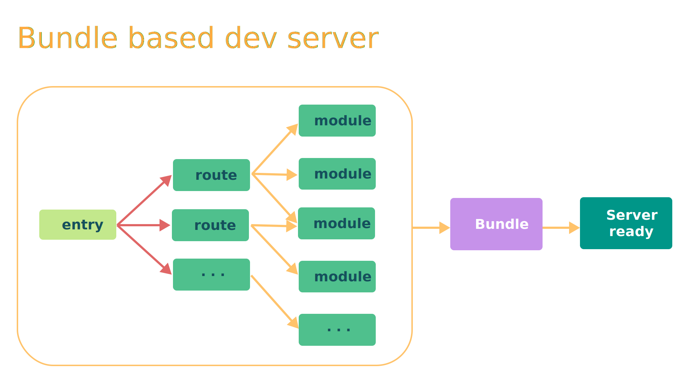
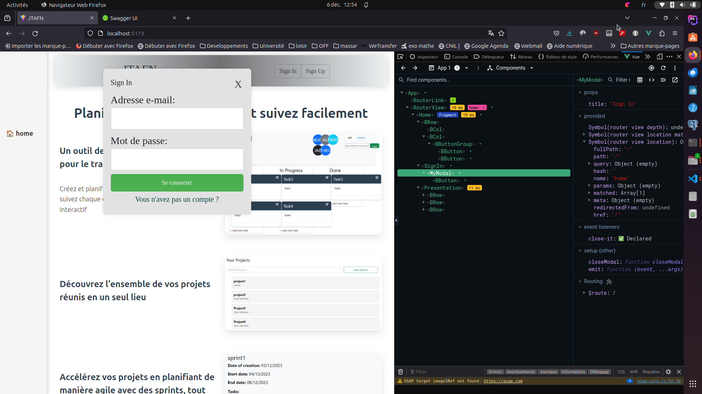
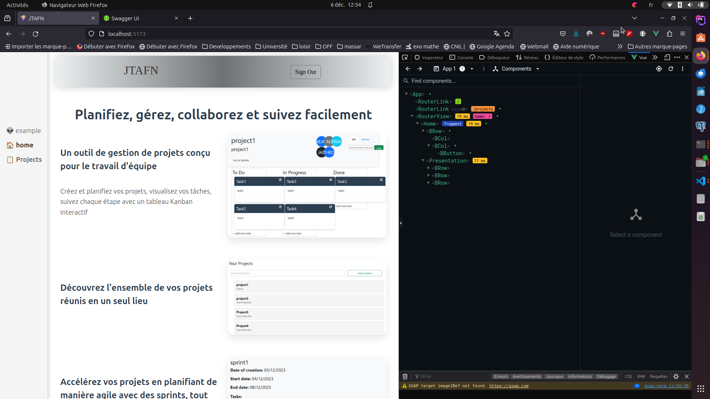
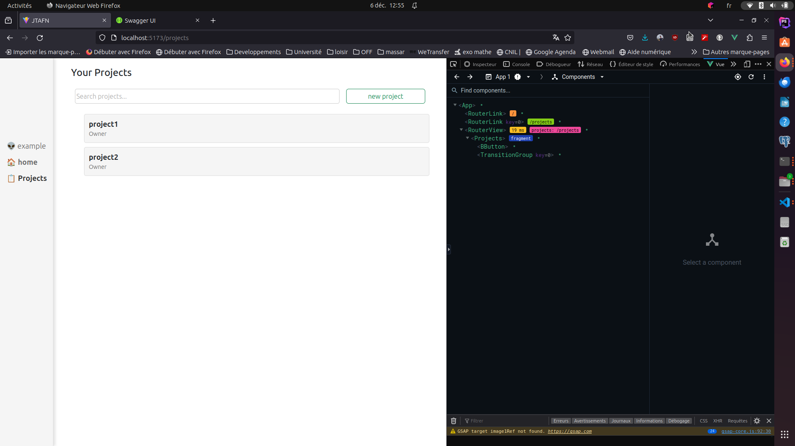

# DM3 

## vite bundling :

### Introduction to ViteJs :  

Vite est un outil de développement rapide pour la création d'applications web modernes, principalement associé au framework Vue.js. Il se distingue par sa rapidité exceptionnelle de construction et de développement, optimisant l'expérience du développeur tout en offrant des performances accrues pour les utilisateurs finaux. Conçu pour prendre en charge le développement par composants, Vite utilise une approche novatrice qui privilégie le chargement asynchrone et le découpage de code.

Avant, pour rendre notre code JavaScript modulaire, on utilisait des outils qui regroupaient tous nos morceaux de code. Mais à mesure que nos projets devenaient plus gros, cela prenait beaucoup de temps pour démarrer et voir nos changements. Vite résout ce problème en utilisant de nouvelles technologies, comme les modules ES natifs dans les navigateurs, pour rendre notre développement plus rapide et agréable [1].

Vite adopte une approche de "lazy loading" pour améliorer les performances des applications en chargeant les ressources de manière asynchrone lorsque cela est nécessaire.

### Lazy loading 

Le lazy loading, ou chargement différé, est une technique qui consiste à retarder le chargement de certaines parties d'une application jusqu'à ce qu'elles soient réellement nécessaires. 

Dans le contexte de Vite, le lazy loading est souvent utilisé pour charger les composants ou les modules de l'application uniquement lorsqu'ils sont demandés, plutôt que de les charger tous au démarrage. Cela peut être particulièrement bénéfique pour les applications volumineuses où charger tous les composants dès le départ peut entraîner des temps de chargement plus longs. Cette approche est particulièrement pertinente pour les composants, les modules, et même les routes d'une application Vue.js. En effet, elle contribue à réduire le temps de chargement initial de l'application en ne téléchargeant que les ressources essentielles au démarrage. 

### Application de lazy loading ? 

Pour illustrer ce mécanisme, nous allons utliser un projet qu'on a developpé en utilisant vueJS avec vite. 

On voit sur la première capture d'écran la page d'acceuil du projet a gauche, et l'extension de vueJS à droite qui nous montre l'arboresence de notre page avec les components qui sont chargés pour cette page spécifique. On trouve les deux boutons pour le SignIn et SignUp, cependant leur contenu n'est pas directement chargé. 

Ensuite, en cliquant sur le bouton SignIn, on aura le contenu de ce component qui est chargé et affiché.  

Une fois que l'utilisateur se connecte, un nouveau bouton apparait a gauche "projects", Un lien vers ce composant sera crée mais pas le contenu. 

Dès qu'on appuie sur "projects", le contenu de ce composant se chargé. On remarque aussi que les composants qui etaient chargé pour le homePage ont disparu. 

Enfin, On peut aussi créer un nouveau projet en appuyant sur le bouton "new project", qui va charger les composantes relatives a cet effet comme les deux nouveaux boutons "create project" et "cancel".

Donc, avec cet exemple, on voit bien le mécanisme de lazy loading de vite proposé par le schéma de la section lazy loading.   

## Conclusion

En conclusion, le mécanisme de Lazy Loading de Vite représente une avancée significative dans l'optimisation des performances des applications web. En adoptant une approche innovante, Vite permet le chargement dynamique des ressources, réduisant ainsi les temps de chargement initial et améliorant la réactivité globale de l'application.
En intégrant intelligemment le Lazy Loading avec d'autres optimisations, Vite se positionne comme un outil de développement moderne, offrant des performances exceptionnelles pour les applications web, en particulier celles de grande envergure. 

## Références :  
[1] [vite.dev](https://vitejs.dev/guide/why.html), site officile de vite, consulté 05-12-2023.
